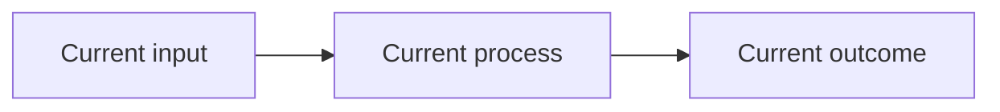
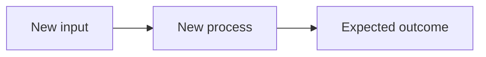

<!-- Title format: [type] Short summary (#issue-number) -->
<!-- Example: [feat] Add SSO support (#123) -->

## Related issue

<!-- Replace placeholder number from source branch. Example: Fixes #123 -->
Fixes #

## Summary

-

## AS-IS

<!--
Describe the current behavior, architecture, or user flow and the problem this PR addresses.
For changes involving a flow, sequence, state transition, architecture, dependency, or ownership
relationship, include a Mermaid diagram. Replace the example below or remove it when not applicable.

-->

- Current behavior:
- Problem / limitation:

## TO-BE

<!--
Describe the desired behavior and how this PR changes the AS-IS state.
Prefer Mermaid for the proposed flow, sequence, state transition, architecture, or dependency.
Keep the diagram aligned with the implementation and acceptance criteria.

-->

- Proposed behavior:
- Expected outcome:
- Migration / rollout notes:

## Verification

- [ ] `pnpm verify`
- [ ] Package-specific build tests, if applicable

Commands and results:

## User impact

- Affected clients, servers, packages:
- User-visible behavior:
- Breaking changes: None

## Metadata checklist

- [ ] PR title type and issue number match the source branch
- [ ] `Fixes #<issue-number>` references the source branch's Issue
- [ ] The linked Issue uses the native Type mapped from the source branch type
- [ ] The Issue is in the configured Project with its `Priority` Field set
- [ ] Mermaid diagrams added or updated for relevant flows, architecture, sequences, state transitions, or dependencies

## Screenshots or recordings

Add when UI behavior changed. Do not include private captures, credentials,
tokens, or production configuration.
